<div align="center">
  <picture>
    <source media="(prefers-color-scheme: dark)" srcset="./assets/header-dark.svg" />
    <source media="(prefers-color-scheme: light)" srcset="./assets/header-light.svg" />
    
  </picture>
</div>

<br/>

<div align="center">
  <picture>
    <source media="(prefers-color-scheme: dark)" srcset="https://readme-typing-svg.demolab.com?font=Inter&weight=600&size=22&duration=3500&pause=1200&color=818CF8&center=true&vCenter=true&width=740&height=46&lines=Building+AI+agents+for+software+engineering;Research+in+generative+AI+%26+NLP;Open+to+collaboration" />
    <source media="(prefers-color-scheme: light)" srcset="https://readme-typing-svg.demolab.com?font=Inter&weight=600&size=22&duration=3500&pause=1200&color=4F46E5&center=true&vCenter=true&width=740&height=46&lines=Building+AI+agents+for+software+engineering;Research+in+generative+AI+%26+NLP;Open+to+collaboration" />
    
  </picture>
</div>

<div align="center">
  <a href="https://abrarsoul.github.io/"></a>
  &nbsp;
  <a href="https://scholar.google.com/citations?user=XWAPaTkAAAAJ&hl=en"></a>
  &nbsp;
  <a href="https://www.linkedin.com/in/abrar-morshed-4442911a1/"></a>
  &nbsp;
  <a href="mailto:abrar.morshed@tuni.fi"></a>
  &nbsp;
  <a href="https://leetcode.com/u/Abrar_Morshed/"></a>
  &nbsp;
  <a href="https://www.youtube.com/@AbrarMorshed-lx4df"></a>
</div>

<br/>

---

### About

I am a **Project Researcher** at [GPT-Lab](https://gpt-lab.eu), Tampere University, working on **AI agentic frameworks** and generative AI for software engineering. My current work includes autonomous agents for code security, LLM-powered research tools, and teaching software process practices with GitHub and GitLab.

I hold an M.Sc. in Software, Web & Cloud from Tampere University, with four years of prior experience in MIS and backend development. I care about research that ships: systems that are useful, evaluable, and maintainable.

```python
class AbrarMorshed:
    role = "Project Researcher @ GPT-Lab"
    affiliation = "Tampere University, Finland"
    focus = ["AI Agents", "Generative AI", "NLP", "Software Engineering"]
    email = "abrar.morshed@tuni.fi"
```

**Now**
- Researching agentic systems for software engineering at GPT-Lab
- Building tools around code security, retrieval, and LLM workflows
- Open to research collaboration and conversation

---

### Toolkit

<div align="center">
  <picture>
    <source media="(prefers-color-scheme: dark)" srcset="https://skillicons.dev/icons?i=py%2Cjava%2Cjs%2Cts%2Ccpp%2Chtml%2Ccss%2Cpytorch%2Cnodejs%2Creact%2Cflask%2Cmysql%2Cdocker%2Clinux%2Cgithub%2Cgitlab%2Cvscode%2Cpostman&amp;theme=dark&amp;perline=9" />
    <source media="(prefers-color-scheme: light)" srcset="https://skillicons.dev/icons?i=py%2Cjava%2Cjs%2Cts%2Ccpp%2Chtml%2Ccss%2Cpytorch%2Cnodejs%2Creact%2Cflask%2Cmysql%2Cdocker%2Clinux%2Cgithub%2Cgitlab%2Cvscode%2Cpostman&amp;theme=light&amp;perline=9" />
    
  </picture>
</div>

<p align="center">
  <sub>Python · Java · JavaScript · TypeScript · C++ · R · PyTorch · React · Flask · Node.js · SQL · Docker</sub>
</p>

---

### Selected work

<table>
  <tr>
    <td width="50%" valign="top">
      <h3><a href="https://github.com/AbrarSoul/Agentic-Code-Security-Auto-Fixer">Agentic Code Security Auto-Fixer</a></h3>
      <p>An autonomous agent that detects vulnerabilities and proposes repairs in source code — part of my GPT-Lab research on agentic software engineering.</p>
      <code>Python</code> · <code>AI Agents</code> · <code>Security</code>
    </td>
    <td width="50%" valign="top">
      <h3><a href="https://github.com/AbrarSoul/AI-Supplier-Contract-Analyzer-with-NLP">AI Supplier Contract Analyzer</a></h3>
      <p>NLP pipeline for reading supplier contracts, extracting obligations, and surfacing risk language for faster review.</p>
      <code>Python</code> · <code>NLP</code> · <code>LLMs</code>
    </td>
  </tr>
  <tr>
    <td width="50%" valign="top">
      <h3><a href="https://github.com/AbrarSoul/AI-Based-Biological-Aging-Frailty-Prediction">Biological Aging Prediction</a></h3>
      <p>Machine learning models for biological aging and frailty prediction, connecting health data to practical clinical signals.</p>
      <code>Python</code> · <code>ML</code> · <code>Healthcare</code>
    </td>
    <td width="50%" valign="top">
      <h3><a href="https://github.com/AbrarSoul/Agentic-Weather-Assistant">Agentic Weather Assistant</a></h3>
      <p>A tool-using weather agent: natural-language queries, live API calls, and structured answers rather than a static dashboard.</p>
      <code>Python</code> · <code>Agents</code> · <code>APIs</code>
    </td>
  </tr>
  <tr>
    <td width="50%" valign="top">
      <h3><a href="https://github.com/AbrarSoul/Abstract-Finder">Abstract Finder</a></h3>
      <p>Research helper for locating and organizing paper abstracts, built to speed up literature review workflows.</p>
      <code>Python</code> · <code>NLP</code> · <code>Research</code>
    </td>
    <td width="50%" valign="top">
      <h3><a href="https://github.com/AbrarSoul/Content-Generation-with-LLMs">Content Generation with LLMs</a></h3>
      <p>Experiments in controllable text generation with large language models — prompting, structure, and evaluation.</p>
      <code>Python</code> · <code>LLMs</code> · <code>NLP</code>
    </td>
  </tr>
</table>

<p align="center">
  <a href="https://github.com/AbrarSoul/COMP.SE.610-620-Autumn-2024-Software-Engineering-Project-1-and-2">Software Engineering Project</a>
  ·
  <a href="https://github.com/AbrarSoul/Smart-Teaching-Assistant-System">Smart Teaching Assistant</a>
  ·
  <a href="https://github.com/AbrarSoul/3D-Architectural-Design-of-National-Parliament-Building-of-Bangladesh">3D Parliament Building Study</a>
</p>

<p align="center"><strong>Live demos</strong><br/>
  <a href="https://bc-news.onrender.com">News dashboard</a>
  &nbsp;·&nbsp;
  <a href="https://weather-update-1-nz0n.onrender.com">Weather dashboard</a>
</p>

---

### Publications

**[Ultrasound-based AI for COVID-19 detection: a comprehensive review of public and private lung ultrasound datasets and studies](https://link.springer.com/article/10.1007/s11042-025-20802-5)**  
*Multimedia Tools and Applications*, 2025 · first author  
A systematic review of lung-ultrasound datasets and AI methods for COVID-19 detection.

**[Innovative trend analysis technique with fuzzy logic and K-means clustering for identification of homogenous rainfall regions](https://doi.org/10.1016/j.qsa.2024.100227)**  
*Quaternary Science Advances*, 2024  
Long-term rainfall analysis over Bangladesh using fuzzy logic and clustering.

<p align="center">
  <a href="https://scholar.google.com/citations?user=XWAPaTkAAAAJ&hl=en">Google Scholar profile →</a>
</p>

---

### GitHub

<div align="center">
  <picture>
    <source media="(prefers-color-scheme: dark)" srcset="https://github-readme-stats.vercel.app/api?username=AbrarSoul&show_icons=true&include_all_commits=true&count_private=true&hide_border=true&bg_color=07070d&title_color=818cf8&icon_color=22d3ee&text_color=e2e8f0&ring_color=6366f1" />
    <source media="(prefers-color-scheme: light)" srcset="https://github-readme-stats.vercel.app/api?username=AbrarSoul&show_icons=true&include_all_commits=true&count_private=true&hide_border=true&bg_color=F8FAFC&title_color=4F46E5&icon_color=0891B2&text_color=1E293B&ring_color=4F46E5" />
    
  </picture>
  <picture>
    <source media="(prefers-color-scheme: dark)" srcset="https://github-readme-stats.vercel.app/api/top-langs/?username=AbrarSoul&layout=compact&langs_count=8&hide_border=true&bg_color=07070d&title_color=818cf8&text_color=e2e8f0" />
    <source media="(prefers-color-scheme: light)" srcset="https://github-readme-stats.vercel.app/api/top-langs/?username=AbrarSoul&layout=compact&langs_count=8&hide_border=true&bg_color=F8FAFC&title_color=4F46E5&text_color=1E293B" />
    
  </picture>
</div>

<div align="center">
  <picture>
    <source media="(prefers-color-scheme: dark)" srcset="https://streak-stats.demolab.com?user=AbrarSoul&hide_border=true&background=07070D&border=07070D&ring=6366F1&fire=22D3EE&currStreakLabel=818CF8&sideLabels=94A3B8&dates=64748B&currStreakNum=E2E8F0&sideNums=E2E8F0&stroke=1E293B" />
    <source media="(prefers-color-scheme: light)" srcset="https://streak-stats.demolab.com?user=AbrarSoul&hide_border=true&background=F8FAFC&ring=4F46E5&fire=0891B2&currStreakLabel=4F46E5&sideLabels=475569&dates=64748B&currStreakNum=0F172A&sideNums=0F172A&stroke=E2E8F0" />
    
  </picture>
</div>

<div align="center">
  <picture>
    <source media="(prefers-color-scheme: dark)" srcset="https://github-readme-activity-graph.vercel.app/graph?username=AbrarSoul&bg_color=07070d&color=94a3b8&line=818cf8&point=22d3ee&area=true&hide_border=true" />
    <source media="(prefers-color-scheme: light)" srcset="https://github-readme-activity-graph.vercel.app/graph?username=AbrarSoul&bg_color=F8FAFC&color=475569&line=4F46E5&point=0891B2&area=true&hide_border=true" />
    
  </picture>
</div>

<div align="center">
  <picture>
    <source media="(prefers-color-scheme: dark)" srcset="./github-contribution-grid-snake-dark.svg" />
    <source media="(prefers-color-scheme: light)" srcset="./github-contribution-grid-snake.svg" />
    
  </picture>
</div>

---

### Let's talk

Happy to talk about research, agentic systems, or a potential collaboration.

<p align="center">
  <a href="mailto:abrar.morshed@tuni.fi">abrar.morshed@tuni.fi</a>
  · Tampere, Finland
  ·
  <a href="https://abrarsoul.github.io/">abrarsoul.github.io</a>
</p>

<p align="center">
  
</p>
